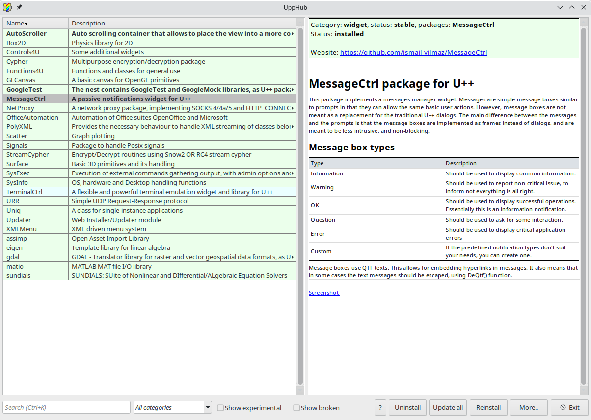

# UppHub

This repository serves as the official global registry for [UppHub](https://www.ultimatepp.org/app$ide$UppHub_en-us.html), the distributed source packages management system for [U++](https://www.ultimatepp.org/index.html).

*Note: This technology is currently a work-in-progress, subject to change, and only available via the nightly builds of U++.*

## Adding your project to this list

In order to register your package(s), please file an issue in this repository or contact maintainers of this list in any other way. You can also suggest the information that the UppHub will provide about your project, ideally as json entry (see bellow).

## The structure of the registry file

The UppHub global registry file, `nests.json`, is a  simple JSON file containing the nests list. Each nest has several entries that need to be filled in.

| Key           | Value                                                               |
|---            | --                                                                  |
| `name`        | The name of the nest.                                               |
| `packages`    | The list of the package(s) in this nest.                            | 
| `description` | A short description of the nest.                                    |
| `repository`  | The link to the nest's repository.                                  |
| `branch`      | The branch to be installed. (Not required).
| `status`      | The status of the nest. See the notes for possible values.          |
| `category`    | The category of the nest: `networking`, `scientific`, `widget`, etc.|
| `readme`      | A link to the `README` file.                                        |

#### Notes

- The `description` will be displayed on the UppHub package manager.
- The value of the `status` entry can be one of the following:
    + `experimental`: Package is not stable, i.e it is in development phase, subject to change and/or requires more testing.
    + `stable`: Package is mature, extensively tested and meant for daily use.
    + `rolling`: Package is mature, extensively tested and meant for daily use, but occasionally or frequently receives new features.
    + `deprecated`: Package is deprecated, has a better alternative, but required by older applications and/or packages.
    + `obsolete`: Package is obsolete. Provided as an archive item.
    + `broken`: Package is currenty broken and cannot be used.
- The value of `category` entry is *provisional, at the moment*.
- The `readme`  file is optional. But it will certainly help you introduce your package to U++ users, as it can be displayed via the UppHub package manager. The format of the README file can be plain text, qtf or markdown.

## Example nest

Let us assume that we wrote a nice little widget called `MessageCtrl`. and we want to register and publish it via UppHub. After forking this repository, we edit the `nests.json`file with our preferred editor, and append the following information to it.

```json
    {
      "name": "MessageCtrl",
      "packages": [
        "MessageCtrl"
      ],
      "description": "A passive notifications widget for U++",
      "repository": "https://github.com/ismail-yilmaz/MessageCtrl.git",
      "status": "stable",
      "category": "widget",
      "readme": "https://raw.githubusercontent.com/ismail-yilmaz/MessageCtrl/main/README.md"
    }
```
Once these changes are validated and merged, the package(s) will be visible and available for download via the UppHub package manager in our integrated development environment, [TheIDE](https://www.ultimatepp.org/app$ide$GettingStarted_en-us.html):


